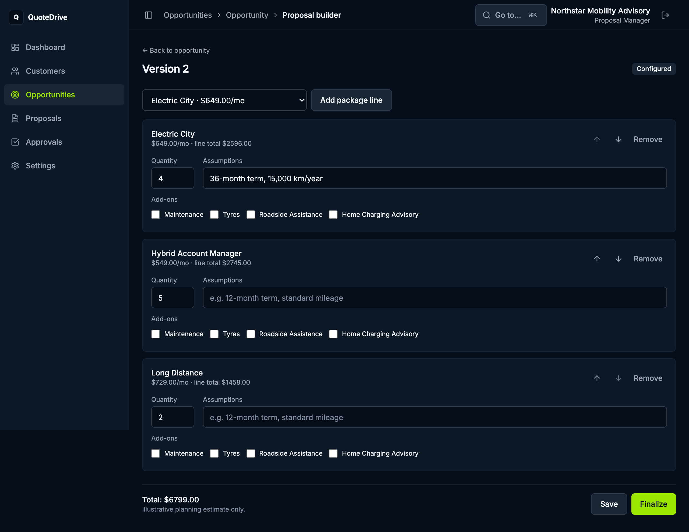
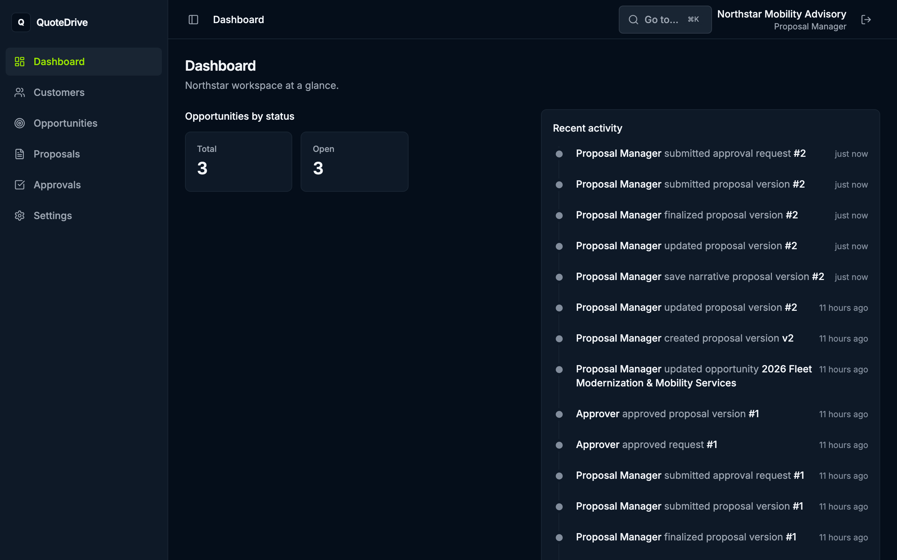
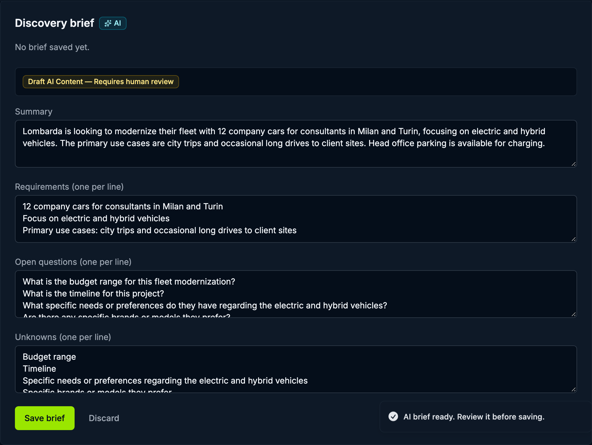
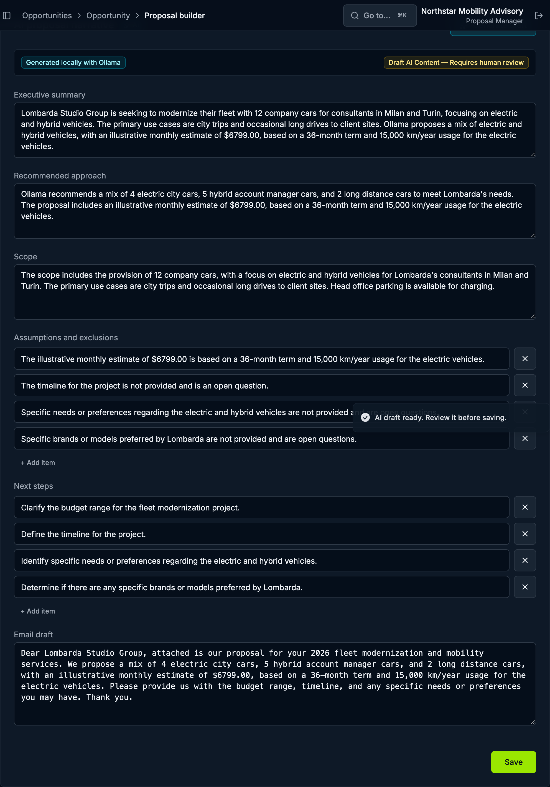
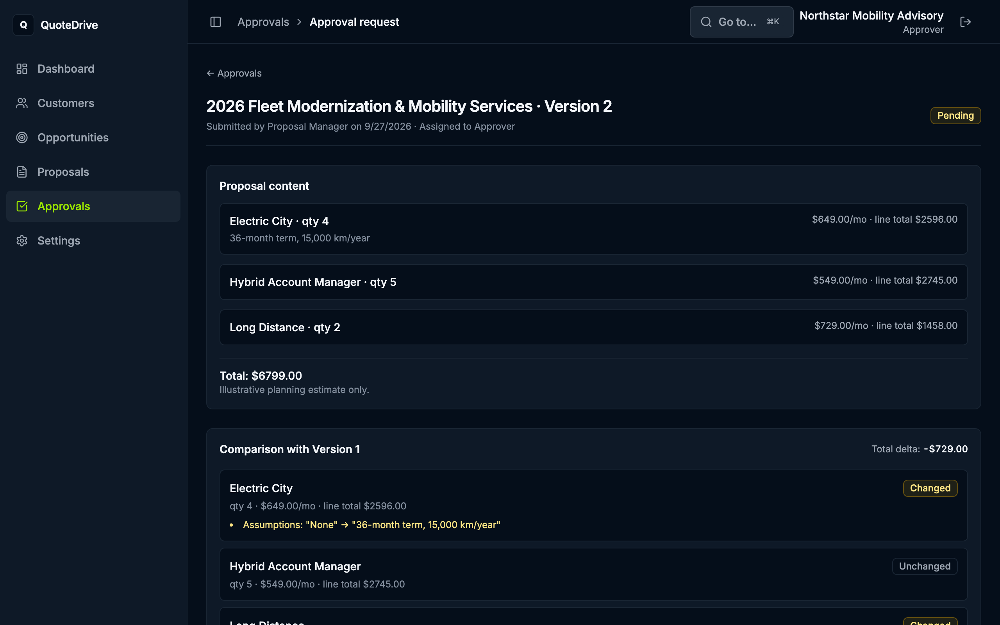
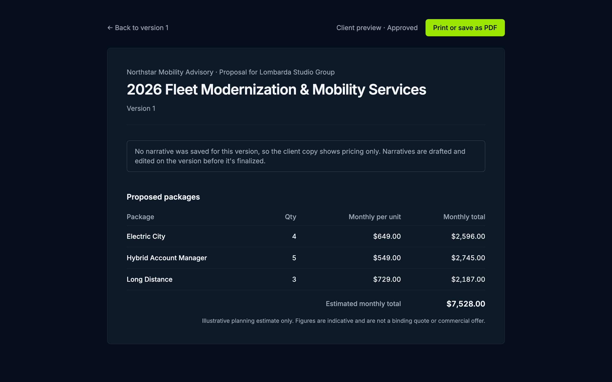
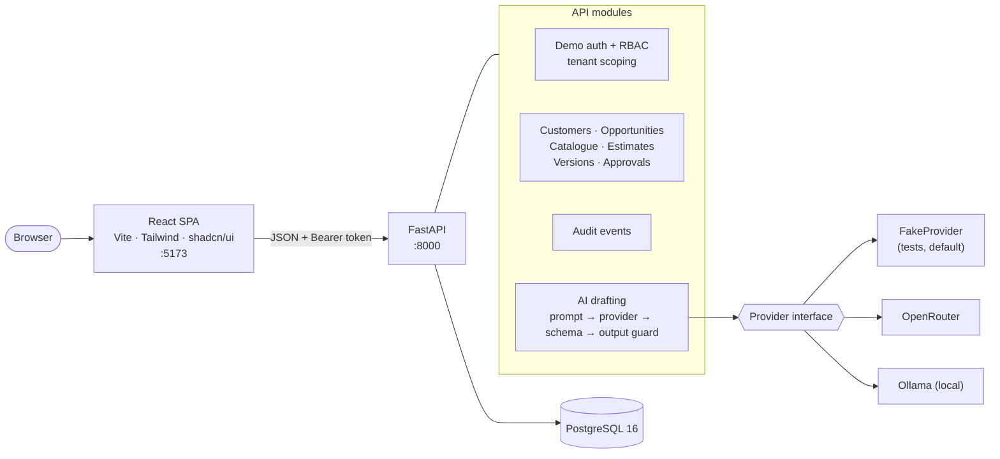

# QuoteDrive

**An AI-assisted, multi-tenant proposal workspace for B2B consulting teams.**
A proposal manager turns discovery notes into a structured brief, configures service packages with deterministic illustrative estimates, drafts the narrative with AI, and sends an immutable version through human approval to a client-ready preview.

QuoteDrive is an educational portfolio case study. It demonstrates product thinking, SaaS architecture, controlled generative AI, tenant isolation, approval workflows and delivery discipline. **All companies, people, vehicles and figures are fictional** (see [Synthetic data](#synthetic-data)).



## Contents
- [What it does](#what-it-does)
- [Quickstart (about 5 minutes)](#quickstart-about-5-minutes)
- [Demo walkthrough](#demo-walkthrough)
- [Architecture](#architecture)
- [How AI is kept safe](#how-ai-is-kept-safe)
- [Tech stack](#tech-stack)
- [Quality gates](#quality-gates)
- [Known limitations and deferred scope](#known-limitations-and-deferred-scope)
- [Documentation map](#documentation-map)

## What it does

| Step | Who | What happens |
|---|---|---|
| 1. Discovery brief | Proposal Manager | Paste call notes; AI drafts summary, requirements, open questions and unknowns. The manager edits and saves it (audited). |
| 2. Configure | Proposal Manager | Pick packages and add-ons from the tenant catalogue. The server calculates an illustrative monthly estimate, never the AI. |
| 3. Draft narrative | Proposal Manager | AI drafts the executive summary, approach, scope and email. Every draft is labelled "Requires human review" and edited before saving. |
| 4. Finalize | Proposal Manager | The version is frozen. Any later change forks a new version. |
| 5. Approve | Approver | Reviews the version and its diff against the previous one, then approves or requests changes (with a comment). You cannot approve your own work. |
| 6. Share | Anyone in the tenant | An approved version renders as a print-friendly client preview. |

Four roles per tenant: **Admin**, **Proposal Manager**, **Approver**, **Viewer**. Every read and write is scoped to the signed-in user's organization.

## Quickstart (about 5 minutes)

Prerequisites: Docker with Docker Compose, and Git. (Node 20 and Python 3.12 are only needed to run tests outside Docker.)

```bash
git clone https://github.com/dorkian/QuoteDrive.git
cd QuoteDrive
docker compose up -d --build
docker compose exec api alembic upgrade head
docker compose exec api python -m scripts.seed_demo
```

Open **http://localhost:5173** and pick a demo user. No password is needed; this is demo sign-in for local use only.

| User | Role | Try this |
|---|---|---|
| `manager@northstar.example` | Proposal Manager | Build and finalize a proposal |
| `approver@northstar.example` | Approver | Approve or request changes |
| `admin@northstar.example` | Admin | Everything a manager and approver can do |
| `viewer@northstar.example` | Viewer | Read-only |

The API runs at http://localhost:8000 (interactive docs at http://localhost:8000/docs). To use other ports, copy `.env.example` to `.env` and set `API_PORT` / `WEB_PORT`. The web app calls `http://localhost:8000` unless `VITE_API_URL` is set in `apps/web/.env`, and the API only accepts browser requests from `http://localhost:5173`.

### Turn on AI drafting (optional)

Out of the box the API uses `FakeProvider`, which calls no model. "Generate draft" then shows a handled error, and you can still write the narrative yourself. To see real drafts, pick a provider in `.env` and restart the API:

```bash
cp .env.example .env
# Local model via Ollama (free): use a model you have pulled, see `ollama list`
#   AI_PROVIDER=ollama
#   OLLAMA_MODEL=qwen2.5:7b
#   AI_REQUEST_TIMEOUT_SECONDS=120
# or a hosted model via OpenRouter:
#   AI_PROVIDER=openrouter
#   OPENROUTER_API_KEY=<your key>
docker compose up -d api
```

Never commit `.env`; it is git-ignored.

## Demo walkthrough

The seed creates the tenant **Northstar Mobility Advisory**, its customer **Lombarda Studio Group** and the opportunity **2026 Fleet Modernization & Mobility Services** (the full narrative is in [docs/product/demo-scenario.md](docs/product/demo-scenario.md)).

1. Sign in as the manager. The dashboard shows pipeline counts and recent activity.
   
2. Open the opportunity. Under **Discovery brief**, paste notes and choose **Draft brief**. Edit the draft and save it.
   
3. Choose **Create draft version**. Add Electric City ×4, Hybrid Account Manager ×5 and Long Distance ×3. The total updates live: **$7,528.00 / month**, illustrative.
4. Under **AI proposal narrative**, choose **Generate draft**, review and edit it, then save.
   
5. **Finalize** the version. The version is now read-only.
6. Submit it for approval. *There is no button for this yet ([QD-412](docs/product/backlog.md)); use the API docs at `/docs`: `POST /proposal-versions/{id}/submit`, then `POST /proposal-versions/{id}/approval-request` with the approver's user id. The Playwright golden path does exactly this.*
7. Sign in as the approver, open **Approvals**, review the diff and **Approve**.
   
8. Open **Client preview** on the approved version.
   

## Architecture

A modular monolith ([ADR-001](docs/adr/ADR-001-modular-monolith.md)): one React app, one FastAPI service and one Postgres database. Tenants share tables and are separated by `organization_id` on every query ([ADR-002](docs/adr/ADR-002-shared-database-tenancy.md)).



More detail: [application architecture](docs/architecture/application-architecture.md), [API contract](docs/architecture/api-contract.md), [data model](docs/architecture/data-model.md), [security and tenancy](docs/architecture/security-and-tenancy.md), [AI provider architecture](docs/architecture/ai-provider-architecture.md).

## How AI is kept safe

AI writes drafts; people own every commercial decision ([ADR-004](docs/adr/ADR-004-human-in-the-loop-ai.md)).

- **Numbers never come from the model.** Estimates are calculated on the server from the catalogue ([ADR-003](docs/adr/ADR-003-deterministic-estimates.md)).
- **Schema-validated output.** Model output must parse into a fixed JSON schema, or the request fails cleanly (502) and nothing is saved ([ADR-007](docs/adr/ADR-007-schema-validated-drafting.md)).
- **Output guard.** A draft is rejected if it contains figures that are not in the proposal data, or discount wording the priced lines don't support. This caught a real prompt-injection success on a local model.
- **Untrusted input is fenced.** Notes and proposal data sit inside delimiters, and the system prompt tells the model to treat them as data. The rule is restated after the data.
- **Nothing auto-saves.** Drafts carry a "Requires human review" label and are saved only when a person chooses Save, which records an audit event.
- **Provenance.** Every generation attempt logs provider, model, prompt version, status and latency, including failures.
- **Evaluated in CI.** Fixture cases in [docs/evaluations](docs/evaluations) run on every PR with FakeProvider, and can be re-run against a real model ([AI evaluation plan](docs/quality/ai-evaluation-plan.md)).

## Tech stack

| Layer | Choices |
|---|---|
| Frontend | React 19, TypeScript, Vite, Tailwind CSS v4, shadcn/ui (Radix), react-router, Vitest + Testing Library |
| Backend | Python 3.12, FastAPI, SQLAlchemy 2.0, Alembic, Pydantic v2, pytest, ruff, mypy (strict) |
| Data | PostgreSQL 16 |
| AI | Provider interface with OpenRouter, Ollama and FakeProvider adapters |
| Quality | GitHub Actions, Playwright, pytest-cov, Vitest coverage, gitleaks |
| Local runtime | Docker Compose |

## Quality gates

Every pull request runs `.github/workflows/ci.yml`:

- **backend**: `ruff format --check`, `ruff check`, `mypy`, `alembic upgrade head --sql` (validates migrations offline), `pytest --cov` (floor 96%).
- **frontend**: `prettier --check`, `oxlint`, `tsc -b`, `vitest run --coverage` (floors in `vite.config.ts`), `vite build`.
- **secrets**: gitleaks over the full git history.
- **E2E**: Playwright golden path and tenant-isolation tests (`.github/workflows/e2e.yml`, currently run manually).

Details, and how to run everything locally: [docs/quality/quality-gates.md](docs/quality/quality-gates.md).

## Known limitations and deferred scope

Known gaps in v1.0.0. Each planned item that isn't built yet has a card; the full audit is in [plan-vs-built.md](docs/product/plan-vs-built.md).
- **Customers and opportunities are created through the API only.** The Customers page is a placeholder (QD-413).
- **No "submit for approval" button.** The API supports it (QD-412).
- **No share or won/lost/expired outcome steps** after approval (QD-414).
- **The catalogue is seed-only**, with no Admin editing (QD-415). **No member or role management**: the Settings page is a placeholder (QD-416).
- **No automatic provider fallback or retry.** One provider is configured at a time (QD-417, [ADR-005](docs/adr/ADR-005-provider-abstraction.md)).
- **The output guard is heuristic.** It can reject harmless text such as "no discount is offered"; scoring and a pass-percentage threshold are planned (QD-418).
- **FakeProvider is the default**, so AI drafting shows an error until a provider is configured.
- **Demo sign-in only.** No passwords or SSO. For local use only, and never to be exposed publicly. The sign-in buttons also have an accessibility defect (QD-419).
- **E2E runs manually in CI** until the end of the current sprint (QD-411).
- **Dark theme only.**

Deliberately out of scope: billing, sending email, PDF rendering (the preview is print-friendly HTML), SSO, third-party integrations, real marketplace data, public deployment, and autonomous agents. See [MVP scope and roadmap](docs/product/mvp-scope-and-roadmap.md).

## Synthetic data

QuoteDrive is not a financial institution, lender, credit-scoring system, binding quote engine, legal tool or compliance product. Every company, customer, vehicle, price and document is fictional or synthetic, and every estimate is labelled "Illustrative planning estimate only". See the [synthetic data policy](docs/product/synthetic-data-policy.md).

## Documentation map

| Area | Start here |
|---|---|
| Product | [Vision](docs/product/product-vision.md) · [Requirements](docs/product/functional-requirements.md) · [Backlog](docs/product/backlog.md) · [Plan vs built](docs/product/plan-vs-built.md) · [Demo scenario](docs/product/demo-scenario.md) |
| Architecture | [Decisions (ADR index)](docs/adr/README.md) · [API contract](docs/architecture/api-contract.md) · [Data model](docs/architecture/data-model.md) |
| Quality | [Quality gates](docs/quality/quality-gates.md) · [Test strategy](docs/quality/test-strategy.md) · [AI evaluation plan](docs/quality/ai-evaluation-plan.md) |
| Operations | [Local development](docs/runbooks/local-development.md) · [AI provider failure](docs/runbooks/ai-provider-failure.md) · [Release checklist](docs/runbooks/release-checklist.md) |
| Delivery | [How the work is run (Trello, Claude Code, Gemini)](docs/delivery/trello-board-spec.md) · [AGENTS.md](AGENTS.md) · [CHANGELOG](CHANGELOG.md) |

## How this was built

Trello is the delivery cockpit, and this repository is the technical source of truth. Claude Code implemented one approved card at a time, Gemini reviewed plans and diffs independently, and the Product Owner approved architecture decisions and accepted work. See [docs/delivery](docs/delivery).

## License

No license has been chosen yet, so all rights are reserved for now. Third-party notices: [THIRD_PARTY_NOTICES.md](THIRD_PARTY_NOTICES.md).
