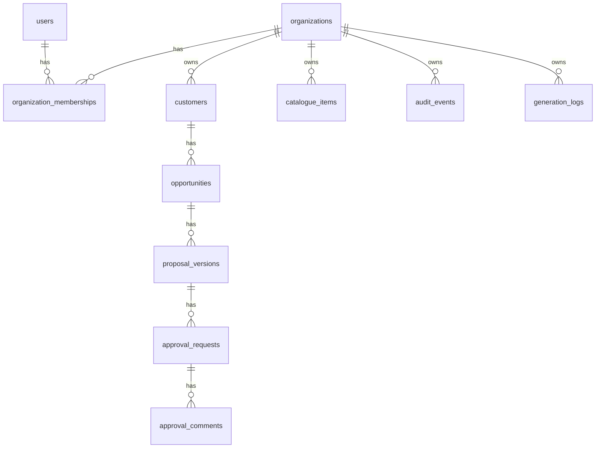

# Data Model (v1.0.0)

Reconciled with `apps/api/app/models` and `apps/api/migrations/versions` on 2026-09-26 (QD-406). Every table below exists after `alembic upgrade head`.

## Tables
- `organizations(id, name, slug, created_at)`
- `users(id, email, display_name, created_at)`
- `organization_memberships(user_id, organization_id, role)`. `role`: `admin`, `proposal_manager`, `approver`, `viewer`.
- `customers(id, organization_id, name, industry, status, created_at)`
- `opportunities(id, organization_id, customer_id, owner_id, title, status, brief_json, created_at)`. `brief_json` holds the human-reviewed discovery brief (`summary`, `requirements`, `open_questions`, `unknowns`, `provider`, `model`).
- `catalogue_items(id, organization_id, type, name, category, base_monthly_estimate, active, created_at)`. `type`: `package` or `add_on`.
- `proposal_versions(id, organization_id, opportunity_id, version_number, status, content_json, narrative_json, total_estimate, created_by, created_at)`.
  - `content_json.lines[]` holds the configured lines (`catalogue_item_id`, `name`, `category`, `quantity`, `add_on_item_ids`, `unit_estimate`, `line_total`, `assumptions`). There is no separate line-items table: a version is an immutable snapshot ([ADR-006](../adr/ADR-006-proposal-versioning.md)).
  - `narrative_json` holds the human-reviewed AI narrative.
  - `status`: `draft`, `configured`, `proposal_drafted`, `awaiting_approval`, `approved`, `shared`, `won`, `lost`, `expired`, `changes_requested`. `changes_requested` is terminal for that version; see [security-and-tenancy.md](security-and-tenancy.md) § Proposal lifecycle.
- `approval_requests(id, organization_id, proposal_version_id, requested_by, assigned_to, status, decision_at, created_at)`. `status`: `pending`, `approved`, `changes_requested`.
- `approval_comments(id, approval_request_id, author_id, body, created_at)`
- `audit_events(id, organization_id, actor_id, actor_name, entity_type, entity_id, action, before_json, after_json, created_at)`. `actor_name` is captured at write time so the history survives renames.
- `generation_logs(id, organization_id, actor_id, actor_name, entity_type, entity_id, provider, model, prompt_version, status, error_detail, latency_ms, created_at)`. One row per AI generation attempt, success or failure. `entity_type` is `proposal_version` (narrative) or `opportunity` (discovery brief). No prompts or outputs are stored.

## Not built (planned in earlier drafts)
- `organizations.settings_json`: no per-tenant settings yet.
- `ai_generations` with `input_hash`, `output_json` and `fallback_reason`: replaced by the leaner `generation_logs`. There is no fallback to record ([ADR-005](../adr/ADR-005-provider-abstraction.md)).

## Tenant rule
Every tenant-owned table has `organization_id` directly, or is reachable only through an already tenant-scoped parent (`approval_comments` through `approval_requests`). Services authorize and scope every query by the caller's organization; see [ADR-002](../adr/ADR-002-shared-database-tenancy.md).
